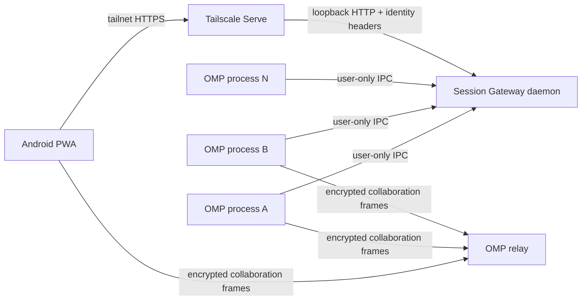

# OMP Session Gateway

**Secure, zero-touch mobile access to every running Oh My Pi session.**

> **Project status: implemented pre-alpha, not production-qualified.** The daemon, authenticated IPC registry, PWA, pinned collaboration client, management CLI, service definitions, release builder, tests, and OMP patch are present. Real Android, Tailscale, relay, and cross-OS acceptance gates remain unqualified. See the [release gate ledger](docs/RELEASE_STATUS.md) and [compatibility matrix](docs/COMPATIBILITY.md).

OMP Session Gateway is a local-first companion for [Oh My Pi](https://github.com/can1357/oh-my-pi) (OMP). After one-time setup, it automatically discovers collaboration endpoints for every live interactive OMP process on a computer and presents them through a private, mobile-first Progressive Web App (PWA).

The dashboard is intentionally a **session switcher and capability broker**, not a second agent client. Tapping **View** or **Control** opens OMP's existing encrypted `collab-web` interface.

This is a community project and is not affiliated with or endorsed by the Oh My Pi maintainers.

## The problem

OMP's `/collab` feature already provides an excellent browser experience, but each running session must currently be started and opened individually. A user with several terminal sessions wants one secure page on an Android phone that:

- lists every live OMP session automatically;
- requires no per-session command, QR scan, or link copy;
- opens either read-only or full-control collaboration;
- removes stale sessions automatically; and
- does not expose collaboration capabilities to the public Internet, logs, or persistent browser storage.

## User experience

After installation and tailnet configuration:

1. `omp-gatewayd` starts automatically when the desktop user logs in; `omp-gateway serve` may provide an equivalent foreground/development entry point.
2. Tailscale Serve exposes only the loopback dashboard/API to approved tailnet identities.
3. Each interactive `omp` process automatically starts collaboration when configured and registers its current view/control capability through authenticated local IPC.
4. The Android PWA lists every live process within a few seconds.
5. Tapping **View** or **Control** launches the pinned OMP browser client.
6. Session switches, exits, crashes, and daemon restarts reconcile without manual cleanup.

## Architecture



The recommended v1 keeps OMP's existing end-to-end-encrypted relay and uses the gateway only for private discovery and just-in-time capability delivery. A self-hosted relay remains an optional later deployment mode.

## Why PWA first

OMP already ships `packages/collab-web`, which renders the transcript, streaming output, tool cards, prompts, interrupts, and subagent controls. A native Android client would duplicate the most security-sensitive and compatibility-sensitive parts of OMP.

The v1 path is therefore:

- mobile-first PWA for the session directory;
- existing OMP `collab-web` for the actual session;
- optional Trusted Web Activity packaging later; and
- no independent native implementation of OMP's collaboration protocol.

## Security model

OMP collaboration links are bearer capabilities. The implementation treats both view and control links as secrets.

Release-blocking invariants include:

- capabilities remain in OMP/gateway/browser memory only;
- list and SSE APIs return metadata only;
- launch capabilities are fetched only after an explicit tap and use `Cache-Control: no-store`;
- no capability enters logs, telemetry, crash reports, files, cookies, Local Storage, IndexedDB, Cache Storage, query strings, or service-worker caches;
- the HTTP server binds only to loopback by default;
- production requests require a verified and allowlisted Tailscale identity;
- the local registry uses user-only IPC plus a random 256-bit installation token;
- stale and replaced generations become unlaunchable promptly; and
- the default deployment never enables Tailscale Funnel.

See [the threat model](docs/SECURITY.md) and [security reporting policy](SECURITY.md).

## Repository layout

| Path | Purpose |
|---|---|
| `apps/gateway` | Loopback daemon, authenticated registry IPC, HTTP API, CLI, services, and diagnostics |
| `apps/web` | Mobile session directory PWA and no-secret service worker |
| `packages/protocol` | Versioned runtime-validated IPC and browser contracts |
| `packages/collab-client` | Pinned OMP `collab-web` source and in-memory bootstrap patch |
| `patches/oh-my-pi` | Apply-ready controller, auto-start, and publisher patch for pinned OMP |
| `scripts/build-web.ts` | Reproducible hashed PWA/client asset build |
| `scripts/build-release.ts` | Deterministic Bun-runtime release archive and SHA-256 manifest |
| `docs/` | Architecture, protocol, security, operations, compatibility, and acceptance plans |
| `UPSTREAM.lock.json` | Exact OMP source and package baseline |

## Build and run

Requires Bun 1.3.14 or newer:

```sh
bun install --frozen-lockfile
bun run check

# Loopback-only development mode
bun apps/gateway/src/cli.ts serve \
  --dev-localhost \
  --port 4317 \
  --origin http://127.0.0.1:4317
```

Production installation requires an exact tailnet HTTPS origin and at least one normalized Tailscale login:

```sh
bun run build
bun apps/gateway/src/cli.ts install \
  --origin https://host.tailnet.ts.net \
  --allow user@example.com
tailscale serve --bg --https=443 http://127.0.0.1:4317
bun apps/gateway/src/cli.ts doctor
```

Never enable Tailscale Funnel. Apply the pinned OMP patch and configure `collab.autoStart` to `view` or
`control`; see [`patches/oh-my-pi/README.md`](patches/oh-my-pi/README.md) and
[`docs/OPERATIONS.md`](docs/OPERATIONS.md).

Build the deterministic Bun-runtime archive and checksum manifest with `bun run release:build`.
The archive remains pre-alpha until every mandatory acceptance gate in [`docs/TEST_PLAN.md`](docs/TEST_PLAN.md)
has passed on the advertised platforms.

## Current upstream baseline

Pinned OMP commit: `39c95e5e29b1c8b082059f57421ce445c3dffdd4`, observed on **2026-07-19** with
**v17.0.5** as the nearest release. See [`UPSTREAM.lock.json`](UPSTREAM.lock.json) for package versions and
source paths.

## Contributing and releases

The project is intended to be developed in public. See:

- [Contributing](CONTRIBUTING.md)
- [Governance](GOVERNANCE.md)
- [Roadmap](ROADMAP.md)
- [Security policy](SECURITY.md)
- [Repository bootstrap](docs/REPOSITORY_BOOTSTRAP.md)

No telemetry, analytics, or hosted control plane is planned for v1.

## License

MIT. See [LICENSE](LICENSE).
