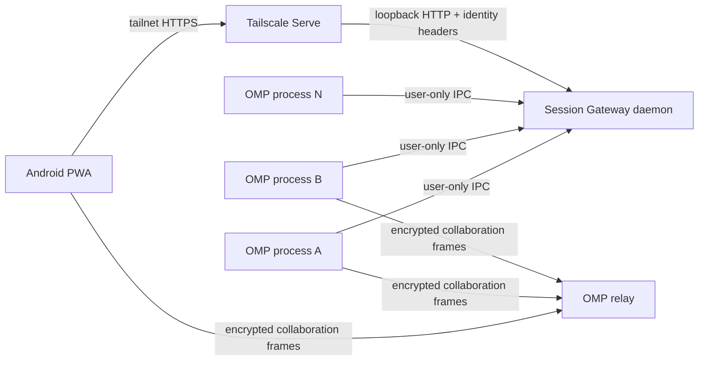

# OMP Session Gateway

**Secure, zero-touch mobile access to every running Oh My Pi session.**

> **Project status: implementation-ready, pre-alpha.** This repository currently contains the architecture, contracts, security requirements, repository scaffold, and implementation-agent instructions. It does not yet contain a production-ready gateway binary.

OMP Session Gateway is a local-first companion for [Oh My Pi](https://github.com/can1357/oh-my-pi) (OMP). After one-time setup, it automatically discovers collaboration endpoints for every live interactive OMP process on a computer and presents them through a private, mobile-first Progressive Web App (PWA).

The dashboard is intentionally a **session switcher and capability broker**, not a second agent client. Tapping **View** or **Control** opens OMP's existing encrypted `collab-web` interface.

This is a community project and is not affiliated with or endorsed by the Oh My Pi maintainers.

## The problem

OMP's `/collab` feature already provides an excellent browser experience, but each running session must currently be started and opened individually. A user with several terminal sessions wants one secure page on an Android phone that:

- lists every live OMP session automatically;
- requires no per-session command, QR scan, or link copy;
- opens either read-only or full-control collaboration;
- removes stale sessions automatically; and
- does not expose collaboration capabilities to the public Internet, logs, or persistent browser storage.

## Proposed user experience

After installation and tailnet configuration:

1. `omp-gatewayd` starts automatically when the desktop user logs in; `omp-gateway serve` may provide an equivalent foreground/development entry point.
2. Tailscale Serve exposes only the loopback dashboard/API to approved tailnet identities.
3. Each interactive `omp` process automatically starts collaboration when configured and registers its current view/control capability through authenticated local IPC.
4. The Android PWA lists every live process within a few seconds.
5. Tapping **View** or **Control** launches the pinned OMP browser client.
6. Session switches, exits, crashes, and daemon restarts reconcile without manual cleanup.

## Architecture

The recommended v1 keeps OMP's existing end-to-end-encrypted relay and uses the gateway only for private discovery and just-in-time capability delivery. A self-hosted relay remains an optional later deployment mode.

## Why PWA first

OMP already ships `packages/collab-web`, which renders the transcript, streaming output, tool cards, prompts, interrupts, and subagent controls. A native Android client would duplicate the most security-sensitive and compatibility-sensitive parts of OMP.

The v1 path is therefore:

- mobile-first PWA for the session directory;
- existing OMP `collab-web` for the actual session;
- optional Trusted Web Activity packaging later; and
- no independent native implementation of OMP's collaboration protocol.

## Security model

OMP collaboration links are bearer capabilities. The implementation must treat both view and control links as secrets.

Release-blocking invariants include:

- capabilities remain in OMP/gateway/browser memory only;
- list and SSE APIs return metadata only;
- launch capabilities are fetched only after an explicit tap and use `Cache-Control: no-store`;
- no capability enters logs, telemetry, crash reports, files, cookies, Local Storage, IndexedDB, Cache Storage, query strings, or service-worker caches;
- the HTTP server binds only to loopback by default;
- production requests require a verified and allowlisted Tailscale identity;
- the local registry uses user-only IPC plus a random 256-bit installation token;
- stale and replaced generations become unlaunchable promptly; and
- the default deployment never enables Tailscale Funnel.

See [the threat model](docs/SECURITY.md) and [security reporting policy](SECURITY.md).

## Repository layout

| Path | Purpose |
|---|---|
| `AGENTS.md` | Authoritative instructions for an implementation agent |
| `AGENT_BRIEF.md` | Short standalone implementation brief |
| `docs/ARCHITECTURE.md` | Components, runtime lifecycle, and trust boundaries |
| `docs/OMP_INTEGRATION.md` | Narrow patch required in OMP |
| `docs/PROTOCOL.md` | Local registry and browser API contracts |
| `docs/SECURITY.md` | Threat model and non-negotiable controls |
| `docs/IMPLEMENTATION_PLAN.md` | Milestone and commit sequence |
| `docs/ISSUE_PLAN.md` | Ready-to-create GitHub issue plan |
| `docs/COMPATIBILITY.md` | OMP baseline and compatibility policy |
| `docs/OPEN_SOURCE.md` | Scope, positioning, licensing, and governance choices |
| `docs/UPSTREAM_STRATEGY.md` | Minimal OMP patch/upstream collaboration strategy |
| `schemas/` | Draft machine-readable API and IPC contracts |
| `apps/` and `packages/` | Workspace implementation targets |
| `patches/oh-my-pi/` | OMP patch series or upstream PR notes |
| `UPSTREAM.lock.json` | Research baseline; must be refreshed before coding |

## Implementation agent entry point

An implementation agent should begin with [AGENTS.md](AGENTS.md), then read the documents in the order specified there. A standalone prompt is also available at [`docs/IMPLEMENTATION_AGENT_PROMPT.md`](docs/IMPLEMENTATION_AGENT_PROMPT.md).

The primary success criterion is:

> Starting three independent interactive OMP processes produces three usable cards on the phone without typing `/collab` or copying a link. Exiting or switching any process removes the old control capability before a replacement can be launched.

## Current upstream baseline

The research snapshot was prepared against OMP **v17.0.5** on **2026-07-19**. OMP is active; the implementation agent must inspect current upstream `main`, pin an exact commit, and update [`UPSTREAM.lock.json`](UPSTREAM.lock.json) before making code changes.

## Contributing and releases

The project is intended to be developed in public. See:

- [Contributing](CONTRIBUTING.md)
- [Governance](GOVERNANCE.md)
- [Roadmap](ROADMAP.md)
- [Security policy](SECURITY.md)
- [Repository bootstrap](docs/REPOSITORY_BOOTSTRAP.md)

No telemetry, analytics, or hosted control plane is planned for v1.

## License

MIT. See [LICENSE](LICENSE).
