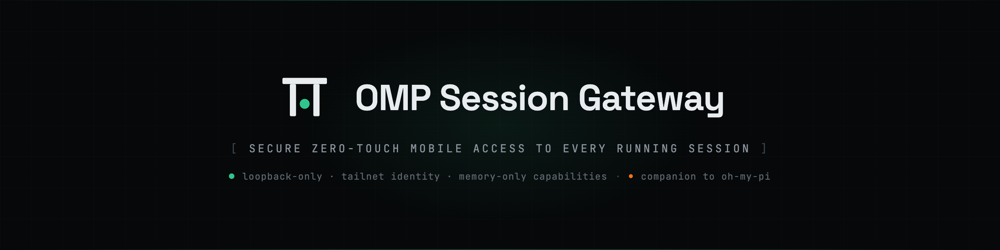
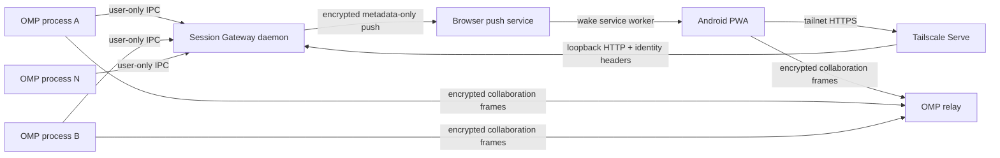

<div align="center">



# OMP Session Gateway

**Secure, zero-touch mobile access to every running Oh My Pi session.**

[![CI][ci-badge]][ci]
[![Windows lifecycle][windows-badge]][windows]
[![Coverage][coverage-badge]][coverage]
[![Latest release][release-badge]][releases]
[![License][license-badge]][license]

[![Project status][status-badge]][status]
[![OMP baseline][omp-badge]][omp-lock]
[![Runtime][bun-badge]][bun]
[![Last commit][commit-badge]][commits]

**[Quickstart](#build-and-run)** · **[Architecture](docs/ARCHITECTURE.md)** ·
**[Security model](docs/SECURITY.md)** · **[Protocol](docs/PROTOCOL.md)** ·
**[Operations](docs/OPERATIONS.md)** · **[Release status](docs/RELEASE_STATUS.md)** ·
**[Compatibility](docs/COMPATIBILITY.md)** · **[Roadmap](ROADMAP.md)**

[ci]: https://github.com/alphastorm/omp-session-gateway/actions/workflows/ci.yml
[ci-badge]: https://img.shields.io/github/actions/workflow/status/alphastorm/omp-session-gateway/ci.yml?branch=main&label=CI&labelColor=0B0E11
[windows]: https://github.com/alphastorm/omp-session-gateway/actions/workflows/platform-qualification.yml
[windows-badge]: https://img.shields.io/github/actions/workflow/status/alphastorm/omp-session-gateway/platform-qualification.yml?event=pull_request&label=windows%20lifecycle&labelColor=0B0E11
[coverage]: https://codecov.io/gh/alphastorm/omp-session-gateway
[coverage-badge]: https://img.shields.io/codecov/c/github/alphastorm/omp-session-gateway?label=coverage&color=1C232B&labelColor=0B0E11
[releases]: https://github.com/alphastorm/omp-session-gateway/releases
[release-badge]: https://img.shields.io/github/v/release/alphastorm/omp-session-gateway?include_prereleases&filter=v*&label=release&color=C99B45&labelColor=0B0E11
[license]: LICENSE
[license-badge]: https://img.shields.io/github/license/alphastorm/omp-session-gateway?color=1C232B&labelColor=0B0E11
[status]: docs/RELEASE_STATUS.md
[status-badge]: https://img.shields.io/badge/status-alpha%2C%20two%20hosts%20qualified-C99B45?labelColor=0B0E11
[omp-lock]: UPSTREAM.lock.json
[omp-badge]: https://img.shields.io/badge/dynamic/json?url=https%3A%2F%2Fraw.githubusercontent.com%2Falphastorm%2Fomp-session-gateway%2Fmain%2FUPSTREAM.lock.json&query=%24.tag&label=OMP%20baseline&color=1C232B&labelColor=0B0E11
[bun]: https://bun.sh
[bun-badge]: https://img.shields.io/badge/dynamic/json?url=https%3A%2F%2Fraw.githubusercontent.com%2Falphastorm%2Fomp-session-gateway%2Fmain%2Fpackage.json&query=%24.packageManager&label=runtime&color=1C232B&labelColor=0B0E11
[commits]: https://github.com/alphastorm/omp-session-gateway/commits/main
[commit-badge]: https://img.shields.io/github/last-commit/alphastorm/omp-session-gateway/main?label=last%20commit&color=1C232B&labelColor=0B0E11

</div>

> **Project status: alpha, qualified for two host platforms and one client.** The alpha decision is
> **GO** for Debian 13 (trixie) x86-64 and macOS 26.6.1 arm64 as hosts, with Chrome `151.0.7922.139`
> on Android 17 as the client, against candidate `v0.1.0-prealpha.17`. Anything outside that
> combination is unqualified and must not be treated as a working deployment path: Windows is
> implemented but **not advertised**, and self-hosted or proxied relay modes remain unsupported.
> Tailscale must run its **TUN-mode** client — the gateway refuses identity headers otherwise, because
> userspace-networking `tailscaled` makes the loopback listener reachable from the whole tailnet
> ([#98](https://github.com/alphastorm/omp-session-gateway/issues/98)). Android recovery after an
> abrupt radio transition is a known limitation
> ([#65](https://github.com/alphastorm/omp-session-gateway/issues/65)). See the
> [release gate ledger](docs/RELEASE_STATUS.md) and [compatibility matrix](docs/COMPATIBILITY.md).

OMP Session Gateway is a local-first companion for [Oh My Pi](https://github.com/can1357/oh-my-pi) (OMP). After one-time setup, it automatically discovers collaboration endpoints for every live interactive OMP process on a computer and presents them through a private, mobile-first Progressive Web App (PWA).

The dashboard is intentionally a **session switcher and capability broker**, not a second agent client. Tapping **View** or **Control** opens OMP's existing encrypted `collab-web` interface.

This is a community project and is not affiliated with or endorsed by the Oh My Pi maintainers.

## The problem

OMP's `/collab` feature already provides an excellent browser experience, but each running session must currently be started and opened individually. A user with several terminal sessions wants one secure page on an Android phone that:

- lists every live OMP session automatically;
- surfaces a metadata-only **Needs attention** state when a session is waiting for human input;
- requires no per-session command, QR scan, or link copy;
- opens either read-only or full-control collaboration;
- removes stale sessions automatically; and
- does not expose collaboration capabilities to the public Internet, logs, notifications, or persistent browser storage.

## User experience

After installation and tailnet configuration:

1. `omp-gatewayd` starts automatically when the desktop user logs in; `omp-gateway serve` may provide an equivalent foreground/development entry point.
2. Tailscale Serve exposes only the loopback dashboard/API to approved tailnet identities.
3. Each interactive `omp` process automatically starts collaboration when configured and registers its current view/control capability through authenticated local IPC.
4. The Android PWA lists every live process within a few seconds. If anything is waiting it shows a
   FIFO **Needs you** queue; otherwise it shows **All clear** and the working sessions.
5. **Open request** launches Control for the oldest ask; **View transcript instead** stays read-only.
   The healthy gateway shell stays quiet, distinguishes gateway and relay interruptions when they
   persist, and keeps each answer at `Sending…` until OMP acknowledges it. After an authoritative
   answer, it offers the next ask or returns to the exact directory order and scroll position.
6. An explicit dashboard action enables background Web Push alerts. Each device chooses Private,
   Session, or Preview detail. A tap revalidates the exact live request and opens Control through
   the ordinary no-store, in-memory launch path; no collaboration capability enters push or a URL.
7. Session switches, exits, crashes, daemon restarts, and phone/tailnet outages reconcile without
   manual cleanup or a prominent Refresh control.

## Architecture


```mermaid
flowchart LR
    OMP1[OMP process A] -->|user-only IPC| GATEWAY[Session Gateway daemon]
    OMP2[OMP process B] -->|user-only IPC| GATEWAY
    OMPN[OMP process N] -->|user-only IPC| GATEWAY

    PHONE[Android PWA] -->|tailnet HTTPS| SERVE[Tailscale Serve]
    SERVE -->|loopback HTTP + identity headers| GATEWAY

    PHONE -->|encrypted collaboration frames| RELAY[OMP relay]
    OMP1 -->|encrypted collaboration frames| RELAY
    OMP2 -->|encrypted collaboration frames| RELAY
    GATEWAY -->|encrypted metadata-only push| PUSH[Browser push service]
    PUSH -->|wake service worker| PHONE
```


The recommended v1 keeps OMP's existing end-to-end-encrypted relay and uses the gateway only for private discovery and just-in-time capability delivery. A self-hosted relay remains an optional later deployment mode.

## Why PWA first

OMP already ships `packages/collab-web`, which renders the transcript, streaming output, tool cards, prompts, interrupts, and subagent controls. A native Android client would duplicate the most security-sensitive and compatibility-sensitive parts of OMP.

The v1 path is therefore:

- mobile-first PWA for the session directory;
- existing OMP `collab-web` for the actual session;
- optional Trusted Web Activity packaging later; and
- no independent native implementation of OMP's collaboration protocol.

## How this differs from `omp-deck`

[OMP Session Gateway](https://github.com/alphastorm/omp-session-gateway) and
[`omp-deck`](https://libraries.io/npm/omp-deck) address different workflows rather than competing
for the same product boundary. The comparison below reflects `omp-deck` 0.6.0's published package
description; check its current documentation before choosing.

| | OMP Session Gateway | `omp-deck` 0.6.0 |
|---|---|---|
| Primary job | Private, zero-touch discovery and launch for already-running interactive terminal OMP processes | A browser cockpit that embeds the OMP SDK and owns the surrounding agent workflow |
| Session experience | Opens OMP's existing encrypted `collab-web` client for View or Control | Provides its own multi-session chat surface |
| Additional state | Keeps only live session metadata and capabilities in daemon memory; does not store transcripts | Adds persisted sessions plus kanban, inbox, knowledge-base, routines, marketplace, and messaging features |
| Remote-access opinion | Loopback gateway behind Tailscale Serve with an exact identity allowlist; no public fallback | Loopback by default, with Tailscale, SSH tunnel, or an authenticated reverse proxy described by its package documentation |
| Best fit | The terminal remains the source of truth and the phone needs the smallest possible session directory and capability broker | The browser should be a persistent work cockpit with project-management and automation features around the agent |

Choose OMP Session Gateway when the desired change is narrowly: “make every current terminal OMP
session safely reachable from my phone without copying links.” Choose `omp-deck` when the desired
change is a broader browser-first operating environment for agent work. The gateway is intentionally
not a chat rewrite, task system, routine engine, knowledge base, or messaging hub; reusing
`collab-web` is the point.

## Security model

OMP collaboration links are bearer capabilities. The implementation treats both view and control links as secrets.

Release-blocking invariants include:

- capabilities remain in OMP/gateway/browser memory only;
- list and SSE APIs return metadata only;
- launch capabilities are fetched only after an explicit tap and use `Cache-Control: no-store`;
- no capability enters logs, telemetry, crash reports, files, cookies, Local Storage, IndexedDB, Cache Storage, query strings, or service-worker caches;
- the HTTP server binds only to loopback by default;
- identity headers are believed only while Tailscale's tunnel device is present, because a
  userspace-networking `tailscaled` forwards inbound tailnet traffic to that loopback listener and
  the caller then arrives indistinguishable from a local one;
- production requests require a verified and allowlisted Tailscale identity;
- the local registry uses user-only IPC plus a random 256-bit installation token;
- stale and replaced generations become unlaunchable promptly; and
- the default deployment never enables Tailscale Funnel.

See [the threat model](docs/SECURITY.md) and [security reporting policy](SECURITY.md).

## Repository layout

| Path | Purpose |
|---|---|
| `apps/gateway` | Loopback daemon, authenticated registry IPC, HTTP API, CLI, services, and diagnostics |
| `apps/web` | Mobile session directory PWA and no-secret service worker |
| `packages/protocol` | Versioned runtime-validated IPC and browser contracts |
| `packages/collab-client` | Pinned OMP `collab-web` source and in-memory bootstrap patch |
| `patches/oh-my-pi` | Apply-ready controller, auto-start, and publisher patch for pinned OMP |
| `scripts/build-web.ts` | Reproducible hashed PWA/client asset build |
| `scripts/build-release.ts` | Deterministic Bun-runtime release archive and SHA-256 manifest |
| `docs/` | Architecture, protocol, security, operations, compatibility, and acceptance plans |
| `UPSTREAM.lock.json` | Exact OMP source and package baseline |

## Build and run

Requires Bun 1.3.14 or newer:

```sh
bun install --frozen-lockfile
bun run check

# Loopback-only development mode
bun apps/gateway/src/cli.ts serve \
  --dev-localhost \
  --port 4317 \
  --origin http://127.0.0.1:4317
```

Production installation requires an exact tailnet HTTPS origin and at least one normalized Tailscale login:

```sh
bun run build
bun apps/gateway/src/cli.ts install \
  --origin https://host.tailnet.ts.net \
  --allow user@example.com
bun apps/gateway/src/cli.ts serve-guidance
bun apps/gateway/src/cli.ts doctor
```

V1 assumes a user-controlled workstation with no mutually untrusted local accounts: a direct loopback caller can forge non-cryptographic Tailscale identity headers. Do not deploy it on a shared shell host.

**Run Tailscale's TUN-mode client on the gateway host.** With
`tailscaled --tun=userspace-networking` there is no tunnel device, so its netstack forwards inbound
tailnet connections to `localhost` and every tailnet peer reaches the loopback listener as a loopback
peer. The daemon detects that and returns `403` to every request rather than believing an identity
header, `doctor` reports `loopbackTrustSound: false`, and the log carries one
`http.identity_trust_unsound`. If a correctly configured host is refused, that check is what to look
at first.

Never enable Tailscale Funnel. Apply the pinned OMP patch and configure `collab.autoStart` to `view` or
`control`; see [`patches/oh-my-pi/README.md`](patches/oh-my-pi/README.md) and
[`docs/OPERATIONS.md`](docs/OPERATIONS.md).

Build the deterministic Bun-runtime archive and checksum manifest with `bun run release:build`.
An archive is qualified only for the exact platform and candidate combination recorded in
[`docs/RELEASE_STATUS.md`](docs/RELEASE_STATUS.md); a build from `main` carries no native
qualification until a lane has been run against those bytes and its record attached to a tag.

## Current upstream baseline

Pinned OMP commit: `858f7dd91fff9b84cf8a2c6a6bb85aa0e6d03a55`, observed on **2026-08-19** at tag
**v17.3.8**. See [`UPSTREAM.lock.json`](UPSTREAM.lock.json) for package versions and
source paths.

## Contributing and releases

The project is intended to be developed in public. See:

- [Contributing](CONTRIBUTING.md)
- [Governance](GOVERNANCE.md)
- [Roadmap](ROADMAP.md)
- [Security policy](SECURITY.md)
- [Repository bootstrap](docs/REPOSITORY_BOOTSTRAP.md)

No telemetry, analytics, or hosted control plane is planned for v1.

## License

MIT. See [LICENSE](LICENSE).
