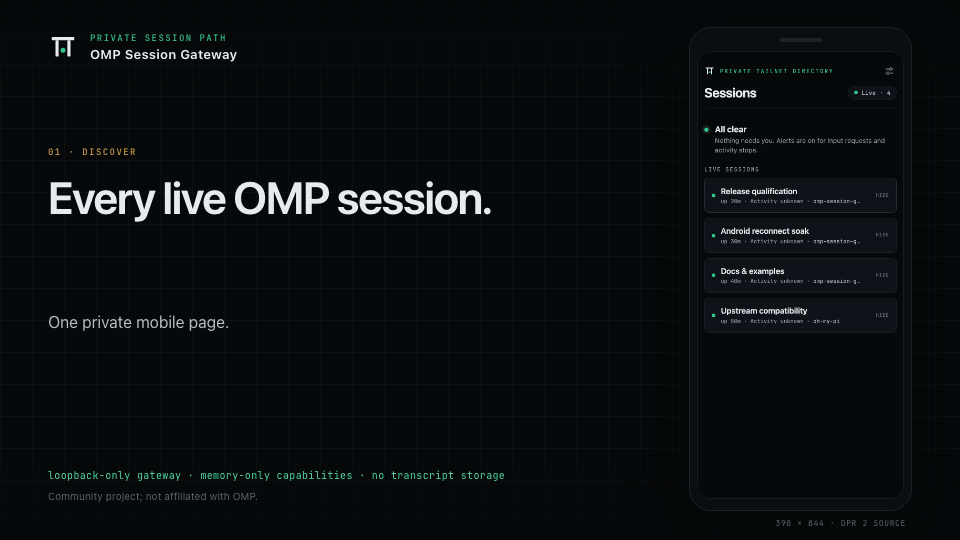
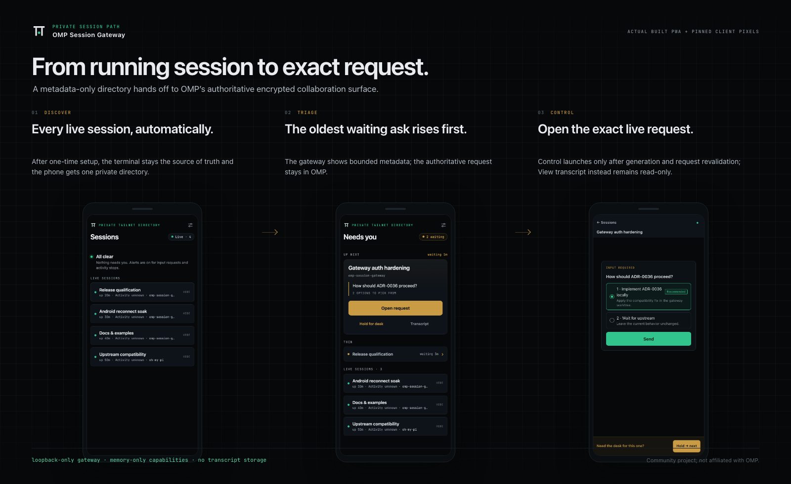
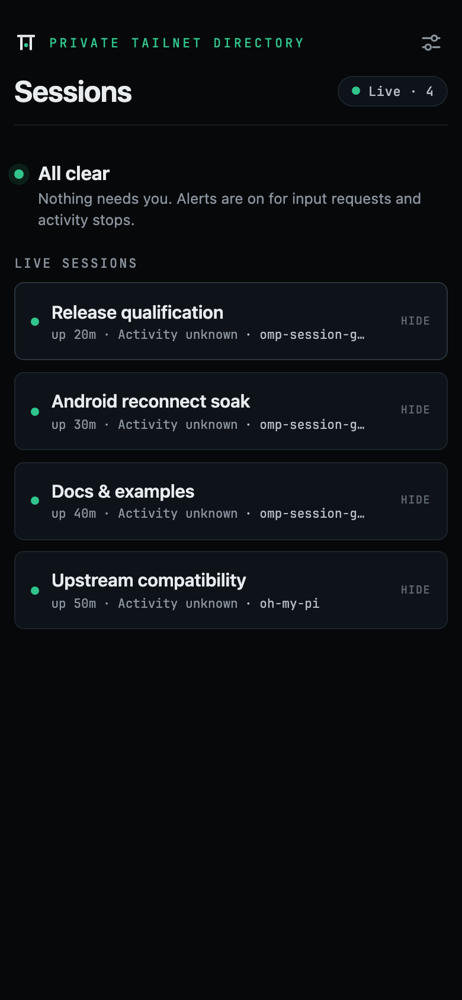
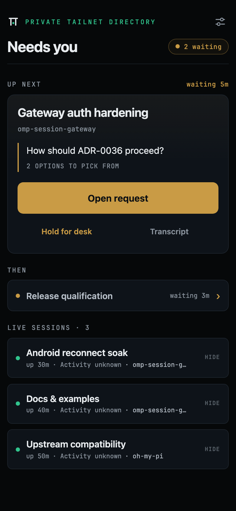
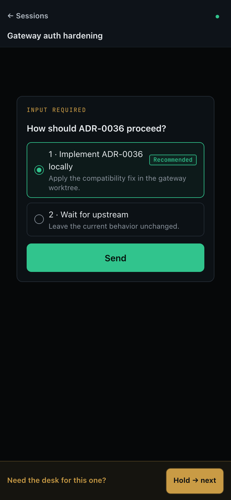
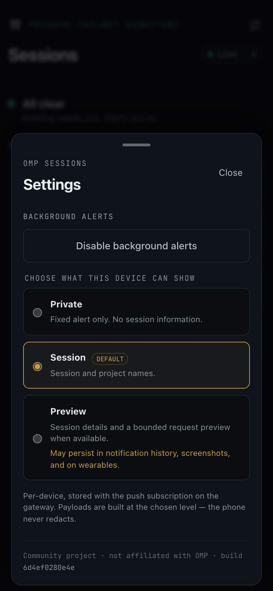
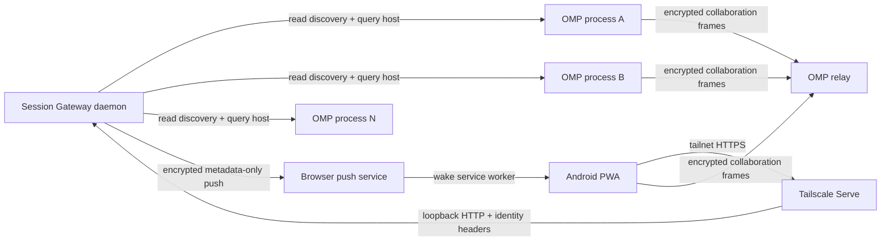

<div align="center">

<picture>
  <source media="(prefers-color-scheme: dark)" srcset="assets/logo.svg">
  <source media="(prefers-color-scheme: light)" srcset="assets/logo-light.svg">
  
</picture>

# OMP Session Gateway

**Every live OMP session. One private mobile page.**

An Android-first PWA that auto-discovers running
[Oh My Pi](https://github.com/can1357/oh-my-pi) sessions, alerts you when one needs input,
and opens the exact encrypted OMP collaboration surface — without QR codes or copied links.



**[Website](https://alphastorm.github.io/omp-session-gateway/)** · **[Build and run](#build-and-run)** ·
**[How it works](#how-it-works)** · **[Security model](docs/SECURITY.md)** ·
**[Compatibility](docs/COMPATIBILITY.md)** ·
**[Stable v0.4.0](https://github.com/alphastorm/omp-session-gateway/releases/tag/v0.4.0)**

[![CI][ci-badge]][ci]
[![Coverage][coverage-badge]][coverage]
[![Releases][release-badge]][releases]
[![OMP baseline][omp-badge]][omp-lock]
[![License][license-badge]][license]

[ci]: https://github.com/alphastorm/omp-session-gateway/actions/workflows/ci.yml
[ci-badge]: https://img.shields.io/github/actions/workflow/status/alphastorm/omp-session-gateway/ci.yml?branch=main&label=CI&labelColor=0B0E11
[coverage]: https://codecov.io/gh/alphastorm/omp-session-gateway
[coverage-badge]: https://img.shields.io/codecov/c/github/alphastorm/omp-session-gateway?label=coverage&color=1C232B&labelColor=0B0E11
[releases]: https://github.com/alphastorm/omp-session-gateway/releases
[release-badge]: https://img.shields.io/github/v/release/alphastorm/omp-session-gateway?include_prereleases&filter=v*&label=release&color=C99B45&labelColor=0B0E11

[omp-lock]: UPSTREAM.lock.json
[omp-badge]: https://img.shields.io/badge/dynamic/json?url=https%3A%2F%2Fraw.githubusercontent.com%2Falphastorm%2Fomp-session-gateway%2Fmain%2FUPSTREAM.lock.json&query=%24.tag&label=OMP%20baseline&color=1C232B&labelColor=0B0E11
[license]: LICENSE
[license-badge]: https://img.shields.io/github/license/alphastorm/omp-session-gateway?color=1C232B&labelColor=0B0E11

<sub><strong>Private by design:</strong> loopback-only gateway · allowlisted tailnet identity · memory-only capabilities · no transcript storage</sub>

</div>

> **Stock OMP is enough: mainline `>= 18.1.20`.**
> The controller and local registry merged upstream in
> [PR #11908](https://github.com/can1357/oh-my-pi/pull/11908) (`4999b98bd5`) and ship in
> [v18.1.20](https://github.com/can1357/oh-my-pi/releases/tag/v18.1.20). Set
> `collab.autoStart` to `view` or `control`, then start sessions with plain `omp`.
> No gateway-specific OMP build or activation route is needed.
>
> **Stable [v0.4.0](https://github.com/alphastorm/omp-session-gateway/releases/tag/v0.4.0) is published.** Signed
> [v0.4.0-prealpha.1](https://github.com/alphastorm/omp-session-gateway/releases/tag/v0.4.0-prealpha.1)
> passed FULL qualification on 2026-09-14 with stock OMP v18.1.20: exact Debian/macOS hosts,
> physical Pixel core flows, migration/recovery, and a fresh 1,800-second relay check.
> Promoted with identical runtime bytes; no fork-era evidence transfers. Tailscale Serve
> with the TUN-mode client, Funnel disabled, and Bun 1.4.0 remain required. Details:
> [compatibility matrix](docs/COMPATIBILITY.md) · [release ledger](docs/RELEASE_STATUS.md).

OMP Session Gateway is a local-first companion for Oh My Pi (OMP). The terminal remains the source
of truth: the gateway is a private directory for already-running interactive OMP processes, a
metadata-only attention queue, and a just-in-time **View**/**Control** capability broker — not a
second agent client. Opening a session hands off to OMP's existing encrypted `collab-web`
interface; the gateway never stores or renders transcripts.

This is a community project and is not affiliated with or endorsed by the Oh My Pi maintainers.

## How it works

<div align="center">

</div>

<table>
  <tr>
    <td align="center" width="33%">
      <br>
      <strong>Every session, automatically</strong><br>
      <sub>No per-session command, QR scan, or link copy.</sub>
    </td>
    <td align="center" width="33%">
      <br>
      <strong>The oldest ask first</strong><br>
      <sub>Bounded metadata outside; the authoritative prompt stays in OMP.</sub>
    </td>
    <td align="center" width="33%">
      <br>
      <strong>One tap to the real session</strong><br>
      <sub>View or Control opens OMP's existing encrypted client.</sub>
    </td>
  </tr>
</table>

<sub>All media on this page is captured from the built app and pinned collaboration client, driven
by seeded synthetic fixture data — no real sessions, hosts, accounts, or capabilities. The media
reflects its recorded capture baseline, not qualification of the current OMP pin. Regeneration
steps: [`docs/media/README.md`](docs/media/README.md) · MP4 master:
[`omp-session-gateway-demo.mp4`](docs/media/omp-session-gateway-demo.mp4).</sub>

## The problem

OMP’s collaboration feature already provides an excellent browser experience. Mainline OMP now
starts and discovers hosts automatically; manually opening each link or QR code on a phone still
does not scale across several terminals. The gateway removes that per-session
ceremony without widening exposure: it lists every live OMP session automatically, surfaces a
metadata-only **Needs you** state when one is waiting for human input, opens read-only or
full-control collaboration in one tap, removes stale sessions on its own, and keeps collaboration
capabilities out of the public Internet, logs, notifications, and persistent browser storage.

## User experience

After installation and tailnet configuration:

1. `omp-gatewayd` starts automatically when the desktop user logs in; `omp-gateway serve` provides
   the equivalent foreground/development entry point.
2. Tailscale Serve exposes only the loopback dashboard/API to approved tailnet identities.
3. Each interactive `omp` process automatically starts collaboration when configured. The gateway
   reads OMP’s discovery directory and polls metadata; it fetches a capability only when you launch.
4. The Android PWA lists every live process within a few seconds: a FIFO **Needs you** queue when
   anything is waiting, otherwise **All clear** and the working sessions.
5. **Open request** launches Control for the oldest ask; **Hold for desk** defers that exact ask on
   this device and advances to the next one without clearing attention; **Transcript** stays
   read-only. **Hide** can remove a non-attention row on this device with Undo and Show all,
   but OMP keeps running. The healthy gateway shell stays quiet, distinguishes gateway and relay
   interruptions when they persist, and keeps each answer at `Sending…` until OMP acknowledges
   it. After an authoritative answer, it offers the next ask or returns to the exact directory
   order and scroll position.
6. **Experimental outside the stable core claim:** the Settings sheet behind the masthead control can enable
   background Web Push alerts and choose Private, Session, or Preview detail. The no-store tap
   path is implemented and capability-free, but closed-PWA/lock-screen/force-stop/network behavior
   is not stable-qualified.
7. Session switches, exits, crashes, daemon restarts, and ordinary foreground/online transport
   replacement reconcile without a prominent Refresh control. Abrupt Android radio transitions do
   not reliably self-heal and may require force-stopping Chrome.

<div align="center">
<br>
<sub>Notification detail is chosen per device; payloads are built at the chosen level — the phone
never redacts.</sub>
</div>

## Compatibility and release status

The approved v0.4.0 target is bound to signed candidate `v0.4.0-prealpha.1`. Its fresh
qualification is limited to the exact combinations below; the minimum OMP version does not
qualify every host, browser, or future OMP release.

| | Current contract |
|---|---|
| OMP prerequisite | Stock mainline `>= 18.1.20`; earlier releases lack the local registry |
| Exact qualified OMP | `v18.1.20`, commit `1bd60c6fbd0e800a75fd09b1e4804af5a5e6d63b`; Bun `1.4.0` |
| OMP settings | `collab.autoStart` only: `off`, `view`, or `control` |
| Remote path | Tailscale Serve over tailnet HTTPS, TUN-mode client, Funnel disabled |
| Qualified Linux host | Debian 13 (trixie) x86-64, Linux `6.12.94+deb13-amd64`; 69/69 migration/recovery invariants, stock OMP publication/revocation, persistence, tagged-identity denial/exposure, uninstall and resource teardown |
| Qualified Mac host | `Mac14,3`, macOS `26.6.1` arm64; `doctor` 18/18, rollback 23/23, install/rotation/reboot-to-login persistence, allowlisted identity and forged-header/exposure checks |
| Qualified core client | Pixel 10 Pro, Android 17 build `CP2A.260805.005`, Chrome `152.0.7977.82`; View read-only, Control writable, prompt accepted, return to directory, same-page lock/Airplane/Doze recovery, seven forbidden capability sinks detectable and clean |
| Fresh relay check | 1,800 seconds, two transitions, final phase `live`; founder-approved 30-minute gate for v0.4.0, not eight-hour endurance |
| Migration/rollback predecessor | `v0.3.0`, fork-era; stopped matching-CLI uninstall/reinstall across the architecture boundary, no credential bundles |

Exact source and package metadata: [`UPSTREAM.lock.json`](UPSTREAM.lock.json). The upstream merge
[PR #11908](https://github.com/can1357/oh-my-pi/pull/11908) (`4999b98bd5`) makes stock OMP
sufficient starting with [v18.1.20](https://github.com/can1357/oh-my-pi/releases/tag/v18.1.20).

The signed-candidate provenance, exact device measurements, and runtime-byte comparison are
recorded in the [release ledger](docs/RELEASE_STATUS.md). Gateway rollback does not switch the
OMP executable or restore fork-era configuration. See [upgrade and rollback](docs/UPGRADE_ROLLBACK.md).

Known limits are part of the claim — read them before installing:

- **TUN mode is mandatory.** With userspace-networking `tailscaled` there is no tunnel device,
  every tailnet peer arrives as a loopback peer, and the gateway fails closed rather than believing
  an identity header ([#98](https://github.com/alphastorm/omp-session-gateway/issues/98)). See
  [Build and run](#build-and-run) for the `doctor` signal.
- **Never enable Tailscale Funnel.** There is no supported public-Internet path.
- **Android radio transitions have a browser-process limitation.** Chrome for Android can wedge its
  process-wide network stack after a radio change while Android remains healthy. The PWA retries
  and, after 45 seconds of uninterrupted visible failure, opens force-stop/reopen help already
  loaded in the PWA shell; it does not
  claim page JavaScript can repair Chrome ([#65](https://github.com/alphastorm/omp-session-gateway/issues/65)).
- **The fresh relay gate is 30 minutes, not eight hours.** Eight-hour endurance was not rerun
  and is not claimed; residual prolonged-operation risk is accepted. No bounded-memory-growth
  claim follows from this check.
- **Specialized attention, branch/resume, and new media qualification are not claimed.** The
  current physical checks qualify the core directory/View/Control path, not these separate lanes.
- **Background Web Push is outside the stable core claim.** Repository and desktop Chromium
  coverage exists, but the exact physical closed-PWA, lock-screen, tap-to-Control,
  stale-generation, force-stop, network-change, and forbidden-sink matrix has not passed.
- **Preview notification detail currently falls back to Session detail** — the OMP snapshot
  carries no bounded preview field.
- **Windows OMP remains unqualified and unadvertised.** Exact signed gateway and mainline OMP
  artifacts must repeat the lane before support is claimed ([#90](https://github.com/alphastorm/omp-session-gateway/issues/90)).
- **Untrusted local accounts are out of scope.** V1 assumes a user-controlled workstation: a direct
  loopback caller can forge non-cryptographic Tailscale identity headers. Do not deploy on a shared
  shell host.
- **Portal Tunnel and self-hosted or proxied relay modes are unsupported.** The gateway supports only
  Tailscale Serve and keeps OMP's existing end-to-end-encrypted relay.

The [compatibility matrix](docs/COMPATIBILITY.md) defines the supported boundary; the
[release ledger](docs/RELEASE_STATUS.md) holds the exact per-candidate evidence and is
authoritative where they disagree.

### Fork-era published-release history

Published `v0.3.0` and signed candidate `v0.3.0-prealpha.3` retain their exact patched OMP
v18.1.14 evidence: Debian 13 x86-64, macOS 26.6.1 arm64, Pixel/Android, relay endurance, and
runtime equivalence. Published `v0.2.1` retains its fork-era patched OMP v17.4.1 baseline. These
archives require their matching source and instructions; no result transfers to mainline.

Fork-era Windows source acceptance on a persistent Server 2025 VM passed install,
reboot→interactive-login startup, `doctor` 17/17, rotation, upgrade/rollback, patched OMP
publication, and uninstall. This is historical evidence only, not Windows OMP qualification.

## Build and run

Use the [qualified signed candidate](https://github.com/alphastorm/omp-session-gateway/releases/tag/v0.4.0-prealpha.1)
for the exact combinations above, or build this mainline-compatible checkout with **Bun 1.4.0**.
Install stock `@oh-my-pi/pi-coding-agent@18.1.20` or later; there is no gateway-specific OMP
build or publisher credential. A source build does not inherit the signed candidate
qualification. The fork-era `v0.3.0` archive requires its matching historical instructions.

```sh
omp --version # must report at least 18.1.20
omp config set collab.autoStart control # or view
omp # start participating interactive sessions normally
```

In a separate terminal, build and run the gateway:

```sh
bun install --frozen-lockfile
bun run check

# Loopback-only development mode
bun apps/gateway/src/cli.ts serve \
  --dev-localhost \
  --port 4317 \
  --origin http://127.0.0.1:4317
```

Production installation requires an exact tailnet HTTPS origin and at least one normalized
Tailscale login:

If a fork-era gateway is already installed, retain its signed archive and private configuration,
then run that archive's `uninstall` command first to stop and unregister its service. Config and
staged runtimes remain in place. Reinstall the mainline gateway only after that stopped
uninstall; do not import fork-era credential bundles. This is not an active in-place credential
migration, and gateway rollback never switches OMP; see [upgrade and recovery](docs/UPGRADE_ROLLBACK.md).

```sh
bun run build
bun apps/gateway/src/cli.ts install \
  --origin https://host.tailnet.ts.net \
  --allow user@example.com
bun apps/gateway/src/cli.ts serve-guidance
bun apps/gateway/src/cli.ts doctor
```

**Run Tailscale's TUN-mode client on the gateway host.** With
`tailscaled --tun=userspace-networking` there is no tunnel device, so its netstack forwards inbound
tailnet connections to `localhost` and every tailnet peer reaches the loopback listener as a
loopback peer. The daemon detects that and returns `403` to every request rather than believing an
identity header, `doctor` reports `loopbackTrustSound: false`, and the log carries one
`http.identity_trust_unsound`. If a correctly configured host is refused, that check is what to
look at first.

Never enable Tailscale Funnel. OMP owns discovery under `~/.omp/run/collab-hosts`; the gateway
only reads it and queries each host. There is no OMP credential to provision to the gateway. See
[`docs/OPERATIONS.md`](docs/OPERATIONS.md) for discovery overrides and diagnostics.

Build the deterministic Bun-runtime archive and checksum manifest with `bun run release:build`.
An archive is qualified only for the exact platform and candidate combination recorded in
[`docs/RELEASE_STATUS.md`](docs/RELEASE_STATUS.md); a build from `main` carries no native
qualification until a lane has been run against those bytes and its record attached to a tag.

## Architecture


```mermaid
flowchart LR
    GATEWAY[Session Gateway daemon] -->|read discovery + query host| OMP1[OMP process A]
    GATEWAY -->|read discovery + query host| OMP2[OMP process B]
    GATEWAY -->|read discovery + query host| OMPN[OMP process N]

    PHONE[Android PWA] -->|tailnet HTTPS| SERVE[Tailscale Serve]
    SERVE -->|loopback HTTP + identity headers| GATEWAY

    PHONE -->|encrypted collaboration frames| RELAY[OMP relay]
    OMP1 -->|encrypted collaboration frames| RELAY
    OMP2 -->|encrypted collaboration frames| RELAY
    GATEWAY -->|encrypted metadata-only push| PUSH[Browser push service]
    PUSH -->|wake service worker| PHONE
```

The recommended v1 keeps OMP's existing end-to-end-encrypted relay and uses the gateway only for
private discovery and just-in-time capability delivery. A self-hosted relay remains an optional
later deployment mode. Deeper detail: [architecture](docs/ARCHITECTURE.md) ·
[protocol](docs/PROTOCOL.md) · [operations](docs/OPERATIONS.md).

## Why PWA first

OMP already ships `packages/collab-web`, which renders the transcript, streaming output, tool
cards, prompts, interrupts, and subagent controls. A native Android client would duplicate the most
security-sensitive and compatibility-sensitive parts of OMP.

The v1 path is therefore:

- mobile-first PWA for the session directory;
- existing OMP `collab-web` for the actual session;
- optional Trusted Web Activity packaging later; and
- no independent native implementation of OMP's collaboration protocol.

## Security model

OMP collaboration links are bearer capabilities. The implementation treats both view and control
links as secrets.

Release-blocking invariants include:

- capabilities are fetched from OMP per launch and never stored by the gateway;
- list and SSE APIs return metadata only;
- launch capabilities are fetched only after an explicit tap and use `Cache-Control: no-store`;
- no capability enters logs, telemetry, crash reports, files, cookies, Local Storage, IndexedDB, Cache Storage, query strings, or service-worker caches;
- the HTTP server binds only to loopback by default;
- identity headers are believed only while Tailscale's tunnel device is present, because a
  userspace-networking `tailscaled` forwards inbound tailnet traffic to that loopback listener and
  the caller then arrives indistinguishable from a local one;
- production requests require a verified and allowlisted Tailscale identity;
- discovery and per-host queries use OMP’s private files, endpoints, and per-host tokens;
- stale and replaced generations become unlaunchable promptly; and
- the default deployment never enables Tailscale Funnel.

See [the threat model](docs/SECURITY.md) and [security reporting policy](SECURITY.md).

## How it compares

Remote access to live OMP sessions is an active ecosystem — see the upstream
[discussion](https://github.com/can1357/oh-my-pi/discussions/6460) that inventories these efforts.
The comparison below was source-verified against each project's public README and package metadata
on **2026-08-21**, with release metadata and PR #1143 status refreshed **2026-09-08**.
The other projects’ feature descriptions remain that dated snapshot; check current documentation before
choosing. None of them — including this one — is affiliated with or endorsed by the Oh My Pi
maintainers. OMP now ships first-party local discovery in v18.1.20; the gateway column below
describes this cutover, while the other projects retain the dated comparison above.

| | OMP Session Gateway | [`omp-deck`](https://github.com/bjb2/omp-deck) 0.6.1 | [`oh-my-portal`](https://github.com/gosuda/oh-my-portal) | [`claudecodeui`](https://github.com/siteboon/claudecodeui) (CloudCLI) | [`pi-agent-dashboard`](https://github.com/BlackBeltTechnology/pi-agent-dashboard) |
|---|---|---|---|---|---|
| Workflow boundary | Private directory, attention queue, and just-in-time View/Control broker for already-running terminal OMP sessions; not a second client | Web cockpit hosting its own OMP SDK sessions plus kanban, plan mode, inbox, knowledge base, routines, and messaging bridges | Skills plugin that exposes an agent from the phone — web chat, real terminal, sharing, notify — for OMP, Claude Code, Codex, Gemini CLI, and opencode | Web/desktop/mobile UI for Claude Code, Cursor CLI, and Codex with chat, shell, file and git explorers | Browser dashboard to spawn, mirror, and drive [`pi`](https://github.com/badlogic/pi-mono) agents; its README states Oh My Pi is **not** supported |
| Zero-touch discovery of live terminal sessions | Yes — reads mainline OMP discovery and queries host metadata; no per-session command | No terminal attach; the deck creates and hosts its own sessions in-process | Per-surface setup through skills; its `omp-collab` skill shares one OMP session over OMP's own path | Discovers existing session files automatically; the OMP mirroring proposal linked below was closed without merging | For `pi` only, via a bridge extension loaded into every session |
| Mobile surface | Android-first installable PWA; signed v0.4.0 candidate qualifies the exact Pixel directory/View/Control/recovery/isolation matrix above; opt-in Web Push remains unqualified | Responsive web app; Telegram bridge for DM-driven use | Phone browser over encrypted Portal tunnels; push via self-hosted ntfy | Responsive mobile design, hosted cloud, and desktop companion apps | Mobile-friendly responsive layout |
| Exact OMP collab client reuse | Yes — View/Control opens OMP's own encrypted `collab-web` client from pinned upstream source; no second chat surface | No — own chat surface over the embedded OMP SDK (`@oh-my-pi/*` 15.1.7) | No — own web chat over OMP RPC; `omp-collab` reuses OMP collab links separately | No — own transcript UI over ACP stdio | No — own WebSocket mirror protocol, `pi` only |
| Attention triage | Metadata-only FIFO **Needs you** queue with device-local exact-ask Hold; non-attention rows can be dismissed and restored on one device without stopping OMP; specialized attention qualification is not claimed | Plan-mode approvals and queued prompts per session; no cross-session attention queue described | `agent-notify` pushes when the agent needs you (labels-only content) | Interactive per-tool approvals in the UI; no cross-session attention queue described | Interactive `ask_user` prompts inside a session view |
| Capability and secret handling | Collaboration capabilities stay memory-only, fetched `no-store` after an explicit tap; never in logs, URLs, push, or browser storage | Provider OAuth/API keys in `~/.omp/agent/auth.db` and a deck-managed `.env`, masked in the UI | Password/token gate per surface; hosted `my.omp.sh` link option is end-to-end encrypted | Agent tools disabled by default and enabled selectively; uses your own provider subscriptions | Provider keys in `auth.json`; paired-device bearer tokens for its MCP endpoint |
| Remote path | Tailscale Serve over tailnet HTTPS only; loopback-only bind, TUN mode required; Funnel, Portal Tunnel, SSH/public tunnels, proxies, and public access unsupported | Loopback-only default; you front it with Tailscale Serve, an SSH tunnel, or an authenticated reverse proxy | Portal relay tunnels — end-to-end encrypted, terminating on your machine, behind a mandatory auth gate | Self-hosted on your network (`[yourip]:port`), documented remote-server setup, or the hosted CloudCLI Cloud | `localhost:8000` by default; optional zrok public tunnel with persistent URLs; mDNS LAN discovery |
| Transcript storage | None — the directory renders bounded metadata only; transcripts stay in OMP | Sessions persist and resume by design (shared `~/.omp/agent` store; deck state in SQLite and markdown) | Web chat keeps conversation memory; the terminal is a live tmux | Session history persisted, with resume and paging | Mirrors live sessions and lazy-loads historical `pi` session files |
| Install maturity and support | **Stock OMP >=18.1.20; signed v0.4.0 candidate qualified.** Exact Debian/macOS/Pixel matrix and fresh 30-minute relay check; [publication status](docs/RELEASE_STATUS.md) | npm `0.6.1` global install or `bunx`; CI matrix and container builds | Plugin-marketplace install; contract-tested frontend bridge | Established npm/Docker/desktop/cloud distribution (AGPL-3.0); **OMP integration PR [#1143](https://github.com/siteboon/claudecodeui/pull/1143) is closed, unmerged as of 2026-09-08** | Mature npm/Electron/Docker installers for `pi`; the only OMP route is a community fork ([`omp-agent-dashboard`](https://github.com/oldschoola/omp-agent-dashboard)), with no upstream integration described |
| Official OMP affiliation | None — independent community project | None | None | None | None; targets `pi`, not OMP |

Where each one shines:

- **`omp-deck`** has the strongest around-the-chat workflow layer — kanban, routines, a knowledge
  base, an inbox, plan-mode approvals, and durable resumable sessions. Choose it when the browser
  should be a persistent cockpit and hosting sessions inside it is acceptable.
- **`oh-my-portal`** has the broadest agent coverage, and is the only one offering full terminal
  access and per-person teammate sharing from a phone, with conversational skill-driven setup.
- **`claudecodeui` (CloudCLI)** has the most established distribution — npm, Docker, desktop apps,
  and a hosted cloud — but the linked OMP integration proposal was closed without merging; do not infer OMP
  support from it.
- **`pi-agent-dashboard`** is the richest dashboard in the `pi` ecosystem (session spawning, flows,
  OpenSpec, plugins, polished installers) — but it targets `pi`, not OMP.
- **OMP Session Gateway** is the only one that attaches through OMP's own encrypted collaboration
  path and reuses the exact upstream client, with zero-touch discovery of terminal sessions, a
  metadata-only attention queue, memory-only capability handling, and per-release qualification
  evidence. Mainline OMP now supplies discovery directly; no gateway-specific OMP build is needed.

Choose OMP Session Gateway when the desired change is narrowly: “make every current terminal OMP
session safely reachable from my phone without copying links.” Choose one of the others when the
desired change is a broader browser-first working environment, multi-agent coverage, or raw
terminal access. The gateway is intentionally not a chat rewrite, task system, routine engine,
knowledge base, or messaging hub; reusing `collab-web` is the point.

## Repository layout

| Path | Purpose |
|---|---|
| `apps/gateway` | Loopback daemon, OMP discovery/query reader, launch broker, HTTP API, CLI, services, and diagnostics |
| `apps/web` | Mobile session directory PWA and no-secret service worker |
| `packages/protocol` | Runtime-validated OMP discovery/query and browser contracts |
| `packages/collab-client` | Pinned OMP `collab-web` source and in-memory bootstrap patch |
| `scripts/build-web.ts` | Reproducible hashed PWA/client asset build |
| `scripts/build-release.ts` | Deterministic Bun-runtime release archive and SHA-256 manifest |
| `scripts/post-release-smoke.ts` | Published-byte local Mac/physical-Android smoke with owned-fixture cleanup |
| `docs/media` | Canonical README media plus its seeded-fixture capture provenance |
| `docs/` | Architecture, protocol, security, operations, compatibility, and release evidence |
| `UPSTREAM.lock.json` | Exact OMP source and package baseline |


## Contributing and releases

The project is intended to be developed in public. See:

- [Contributing](CONTRIBUTING.md)
- [Backlog](docs/BACKLOG.md)
- [Release status](docs/RELEASE_STATUS.md)
- [Security policy](SECURITY.md)

The project has no telemetry, analytics, or hosted control plane.

## License

MIT. See [LICENSE](LICENSE).
