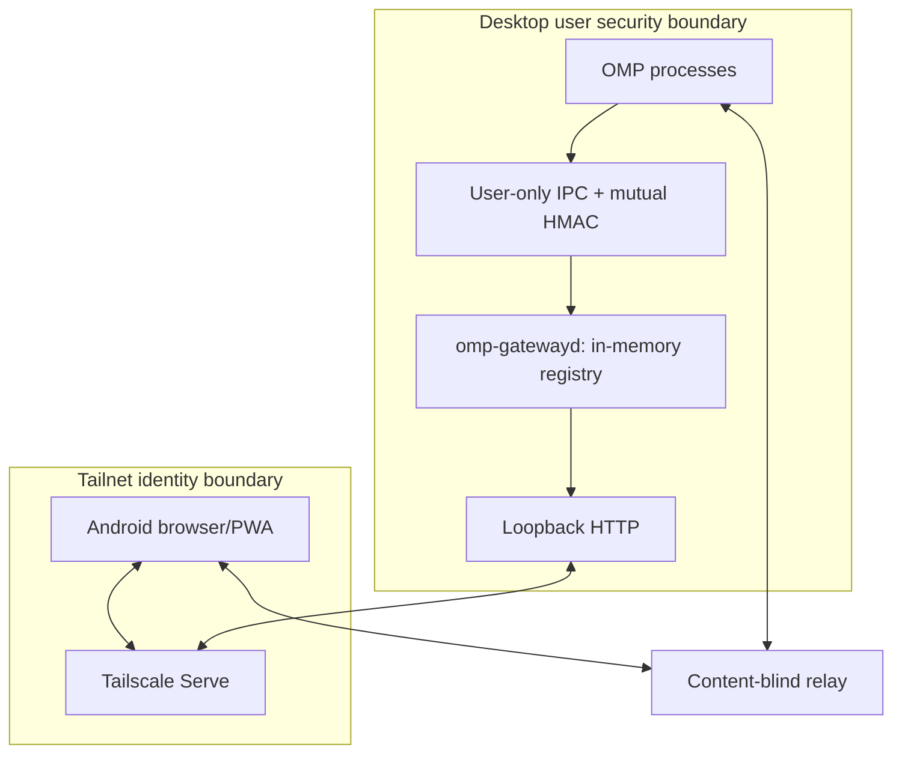

# Architecture

## 1. Components

### 1.1 OMP collaboration controller

A reusable controller owns OMP's existing `CollabHost` and its lifecycle. The current `/collab` slash command and automatic startup must delegate to the same owner so there is one source of truth for room creation, link roles, status, restart, and shutdown.

Responsibilities:

- start, stop, and report status around the existing `CollabHost`;
- expose full and view capabilities only to trusted in-process consumers;
- emit lifecycle events such as `started`, `updated`, `stopped`, and `faulted`;
- restart safely on active-session replacement when automatic startup is enabled;
- preserve all current manual collaboration behavior.

The exact API name should follow the pinned OMP revision. `CollabController` is a proposed shape, not a requirement to ignore a newer supported upstream API.

### 1.2 OMP registry publisher

A small in-process client publishes one live record per interactive OMP process to the local gateway.

Responsibilities:

- discover the platform IPC endpoint;
- authenticate both publisher and gateway with fresh nonces and domain-separated HMAC proofs derived from the private per-install key; never transmit that key;
- publish minimal metadata plus the capabilities permitted by configuration, and refresh the same generation's bounded title, directory basename, model label, and boolean response-required state when they change;
- heartbeat and reconnect with bounded jittered backoff;
- revoke old generations before publishing replacements;
- remove the entry on stop, shutdown, or fatal host error;
- retain and replay only bounded serializable host-origin UI requests so a later writable guest can answer once, while View guests and unsafe/custom response surfaces remain local-only;
- never persist, print, or log capability-bearing objects.

The publisher may live in OMP core initially or in an extension after upstream exposes a supported collaboration API.

### 1.3 `omp-gatewayd`

A per-user daemon is the sole aggregator and remote authorization point.

Responsibilities:

- listen on a Unix-domain socket or Windows named pipe for OMP publishers;
- maintain an in-memory registry with process/session generations and heartbeat TTLs;
- expose a loopback-only HTTP server and static PWA;
- authorize requests using Tailscale Serve identity plus an application allowlist;
- return a single capability only after an explicit View or Control action;
- stream metadata-only updates with SSE;
- start at desktop login and recover cleanly from restart;
- embed or serve a pinned build/integration of OMP's existing `collab-web` client;
- provide `install`, `status`, `doctor`, token rotation, and `uninstall` through `omp-gateway`.

The registry is intentionally empty after daemon restart. Live OMP publishers repopulate it; no capability database exists.

### 1.4 OMP Sessions PWA

The PWA is a deliberately small session directory and launcher.

Each card may show only non-secret metadata:

- friendly title;
- repository or directory basename, with full paths disabled by default;
- model label when configured;
- process start and last-seen time;
- health/streaming state if available without transcript data;
- boolean response-required state, rendered as **Needs attention**, without prompt content, counts, or request identity;
- **View** as the primary action;
- **Control** as a distinct action only when available.

The PWA never prefetches capabilities. It receives metadata from `GET /api/v1/sessions` and `GET /api/v1/events`, then requests one capability after an explicit tap.

An explicit dashboard action may enable foreground browser notifications for authoritative
false-to-true response-required transitions. Permission is never requested on load. Notification
taps focus or open the metadata directory at `/`; they never launch or prefetch Control. State and
deduplication remain volatile, so one live dashboard tab is recommended and background or
killed-browser delivery is not supported.

### 1.5 Existing OMP collaboration client

Reuse a pinned OMP `packages/collab-web` revision. Do not independently implement the transcript, tool cards, subagent controls, relay protocol, or cryptography.

Preferred integration:

1. expose a small upstreamable client bootstrap such as `startWithCapability(capability)` or a component prop;
2. render or mount the client from the same PWA origin;
3. keep the capability in JavaScript memory only;
4. dispose of references when leaving the session;
5. return to the directory on reload because the capability is intentionally not recoverable.

A same-origin child window plus `MessageChannel` is acceptable when keeping the client in a separate page: open `/client/` synchronously during the tap, fetch the capability in the opener, transfer it with a same-origin `postMessage`, and never put it into a URL or DOM attribute.

Temporary compatibility fallback only:

- navigate to a fragment-based OMP deep link;
- parse synchronously;
- immediately remove the secret with `history.replaceState`;
- prohibit release until browser-history and cache tests prove the fragment is gone.

The in-memory bootstrap is the target design because fragments can remain in browser history before replacement and can leak through screenshots or copied URLs.

### 1.6 Relay

**v1:** use OMP's existing encrypted collaboration relay. OMP seals collaboration payloads before the socket, and the gateway does not need to proxy WebSockets.

**Optional hardened mode:** self-host OMP's content-blind relay on the desktop or tailnet. Keep it a separate opt-in deployment and validate long-lived WebSocket behavior, Android sleep/resume, network changes, and reconnects through the exact production proxy path before calling it supported.

## 2. Runtime flow

### 2.1 Desktop login

1. The OS starts `omp-gatewayd` as the current user.
2. The daemon atomically creates or reads the local publisher token.
3. It creates the IPC endpoint with current-user-only permissions.
4. It binds HTTP to loopback, for example `127.0.0.1:4317`.
5. A persistent Tailscale Serve mapping exposes that loopback server privately over tailnet HTTPS.

### 2.2 OMP process start

1. Interactive OMP finishes creating the active session/context.
2. If automatic collaboration is enabled, the shared controller starts the room.
3. The publisher connects to the gateway, authenticates, and sends `upsert` for generation 1.
4. The daemon stores metadata and capabilities in separate in-memory structures.
5. It increments the directory revision and emits a metadata-only SSE event.
6. The phone renders the new card.

When an admitted host-origin response operation begins, the controller acquires a
generation-scoped lease and republishes the same generation with `inputRequired: true`. The daemon
emits only that boolean with ordinary metadata. The host retains the bounded request until a
writable guest joins or the local side settles it. The last lease release republishes `false`
before any generation removal; stale releases from prior generations are ignored.

### 2.3 View or Control launch

1. The user taps **View** or **Control**.
2. For a separate client page, browser code opens `/client/` synchronously to preserve the user gesture; for an integrated SPA, it reserves the client route in memory.
3. The PWA performs a same-origin `POST /api/v1/sessions/:instanceId/launch` with the observed generation and desired mode.
4. The gateway verifies Tailscale identity, application allowlist, Origin, fetch metadata, content type, rate limits, generation, freshness, and mode availability.
5. The no-store response returns exactly one capability.
6. The PWA passes the capability directly to the pinned collab client's in-memory bootstrap, optionally through a same-origin `MessageChannel`.
7. The client connects directly to the relay encoded by OMP's parser.
8. Leaving the client drops capability references and returns to the metadata directory. Reload does not reconnect automatically.

### 2.4 Session switch, resume, or branch

Treat any lifecycle transition that invalidates OMP's current collaboration host as a generation change:

1. mark generation N unavailable locally;
2. send `remove` for generation N;
3. stop/release the old host;
4. start a fresh host for the new active session;
5. publish generation N+1;
6. update the existing process card without exposing the old capability.

If steps 2 or 3 fail, do not publish N+1 until the local publisher state guarantees the old generation cannot be launched through the gateway.

### 2.5 Crash and stale cleanup

The daemon records receipt time using a monotonic clock. A sweeper removes entries after the configured TTL; a recommended baseline is a 10-second heartbeat and 35-second TTL. Socket close may remove immediately, but TTL remains the crash and partial-failure safety net.

A stale or removed generation is deleted from both metadata and capability maps before an SSE removal event is emitted.

## 3. Trust boundaries

A malicious process running as the same desktop OS user is outside the intended threat boundary; it can generally read the user's files or interfere with OMP directly. OS permissions and the publisher token still reduce accidents and cross-user access but are not a sandbox against same-user malware.

A compromised or unlocked phone with valid tailnet identity is also capable of requesting sessions until the device is revoked. Optional WebAuthn user verification reduces this risk for Control.

## 4. Why not process scanning or terminal automation?

Process enumeration can find PIDs but cannot safely attach OMP's browser collaboration protocol to an existing interactive context or recover a capability without reading process memory. Simulated keystrokes, terminal scraping, QR decoding, and clipboard monitoring are fragile and create additional secret channels.

The documented extension lifecycle can observe session events, but the handoff cannot assume it exposes ownership of the built-in collaboration host. A small supported API is cleaner than private deep imports. Revalidate this against the pinned OMP revision before implementing.

## 5. Availability behavior

- Gateway unavailable: OMP continues normally; the publisher retries silently and boundedly.
- Relay unavailable: cards remain visible, but the client reports relay connectivity failure without exposing the capability.
- Tailscale unavailable on the phone: there is no public fallback.
- Desktop asleep or offline: the static shell may show an offline message but no stale session metadata.
- Gateway restart: it starts empty; live publishers reconnect and repopulate.
- OMP crash: socket closure or TTL removes the card and capability.
- Browser reload: returns to the directory; capability persistence is intentionally absent.
