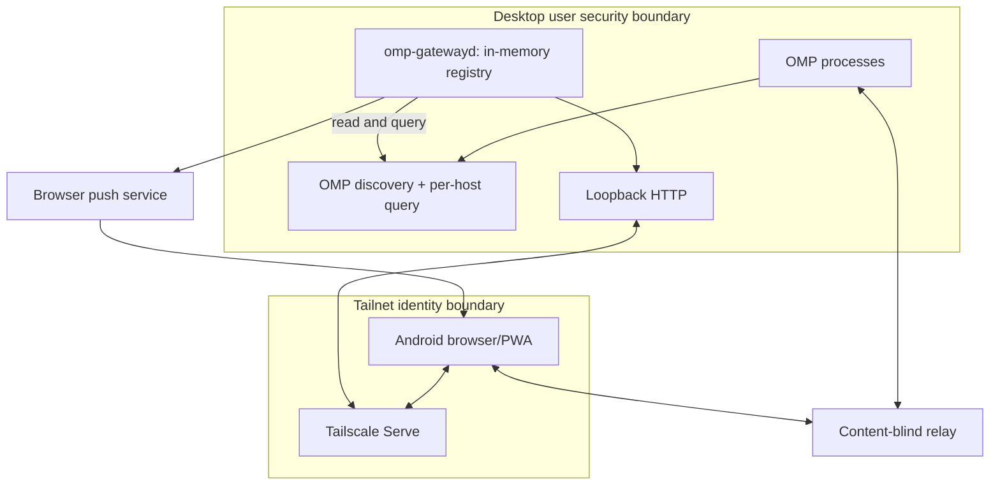

# Architecture

## 1. Components

### 1.1 Mainline OMP discovery reader

Stock mainline OMP `>= 18.1.20` owns its collaboration controller and per-host local registry.
[PR #11908](https://github.com/can1357/oh-my-pi/pull/11908), merge `4999b98bd5`, ships in [OMP v18.1.20](https://github.com/can1357/oh-my-pi/releases/tag/v18.1.20). No fork, custom OMP build, or gateway-specific OMP plugin is required.
The gateway remains a separate installation: enable `collab.autoStart` once, then start plain
`omp`. Bun 1.4.0 and TUN-mode Tailscale Serve remain deployment prerequisites; see
[OMP_INTEGRATION.md](OMP_INTEGRATION.md).

`OmpHostReader` reads discovery entries under `~/.omp/run/collab-hosts` (or the configured
`omp.discoveryDir`) and queries each entry’s published `endpoint` with its per-host token.
OMP may relocate a long socket path; deriving a socket name from the JSON filename is incorrect.
The gateway never writes, renames, or unlinks anything in the discovery directory.

Snapshot queries return metadata only. OMP owns publication and cleanup, independently of the
gateway. The file shape and one-request-per-connection wire contract are in [PROTOCOL.md](PROTOCOL.md).

### 1.2 Host poller and launch broker

`startHostPoller` coalesces concurrent polls, reads host snapshots, and reconciles the metadata-only
`SessionRegistry`. `registry.heartbeatSeconds` is the poll interval (default 10 seconds), not a
publisher heartbeat. Hosts absent from discovery or conclusively dead are removed; transient query
failures retain an existing card until `registry.ttlSeconds` (default 35 seconds) expires. Only
`ENOENT`/`ECONNREFUSED` proves a queried host finished; a timeout, `EMFILE`, `EACCES`, or wire
error such as `snapshot_unavailable` must not retire it immediately.

`OmpLaunchResolver` is the launch broker. After the HTTP authorization checks, it verifies the
observed generation, requested access, and optional attention request identity; queries OMP for a
`link` for that exact generation and access; and revalidates before returning a capability.
`mode_unavailable` refuses a role no longer shared.

The gateway fetches capabilities **only per explicit launch**. It never stores or caches them,
including in the registry: their gateway lifetime is confined to the query and no-store launch
response. This is strictly narrower than the fork-era in-memory secret store, which retained links
for the lifetime of a published session.

### 1.3 `omp-gatewayd`

A per-user daemon is the sole aggregator and remote authorization point.

Responsibilities:

- read OMP discovery and query per-host endpoints;
- maintain an in-memory metadata registry with process/session generations and freshness TTLs;
- expose a loopback-only HTTP server and static PWA;
- authorize requests using Tailscale Serve identity plus an application allowlist;
- return a single capability only after an explicit View or Control action;
- stream metadata-only updates with SSE;
- start at desktop login and recover cleanly from restart;
- embed or serve a pinned build/integration of OMP's existing `collab-web` client;
- persist private VAPID/subscription material separately from the memory-only session registry and send metadata-only Web Push attention/resolution envelopes;
- provide `install`, `status`, `doctor`, token rotation, and `uninstall` through `omp-gateway`.

The registry is intentionally empty after daemon restart. The next host poll repopulates it; no capability store exists.

### 1.4 OMP Sessions PWA

The PWA is a deliberately small session directory and launcher.

Each card may show only non-secret metadata:

- friendly title;
- repository or directory basename, with full paths disabled by default;
- model label when configured;
- process start and last-seen time;
- health/streaming state if available without transcript data;
- boolean response-required state, rendered as **Needs attention**, with an opaque request identity
  and receipt timestamp but no prompt content or answer data;
- **View** for ordinary read-only launches and **Open request** for attention requiring Control;
- **Hold for desk** for exact-ask local queue routing; and
- **Hide** for reversible device-local hiding of non-attention rows, presented as a
  compact per-row control with an explicit accessible label.

A directory with zero live sessions shows the `collab.autoStart` empty-state guidance instead of a
zero-count summary. Device-scoped preferences — the background-alert toggle, notification detail,
and build identity — live in one Settings sheet behind a persistent masthead control; the `All
clear` summary claims "You'll get pinged" only while alerts are enabled and otherwise offers the
Settings path.

The PWA never prefetches capabilities. It receives metadata from `GET /api/v1/sessions` and
`GET /api/v1/events`, then requests one capability after an explicit tap.

Couch triage is a device-local presentation layer over that authoritative metadata. **Hold for
desk** stores only the exact `(instanceId, requestId, heldAt)` identity of an ask and skips it in
this device's FIFO rotation; it does not clear gateway attention, reduce the pending count or app
badge, or affect another device. **Hide** is available only on non-attention rows and stores
only `(instanceId, generation, dismissedAt)`; it hides the row on this device, performs no network
mutation, and never stops the OMP process. A five-second Undo and a persistent **Show all** surface
make dismissals reversible. Active-shell Hold commits only after the next launch succeeds; a launch
failure leaves the current ask in rotation and offers retry without unmounting its collaboration
shell.

Authoritative snapshots and upserts remove a held record when its exact ask changes or clears, and
remove a dismissal when the session disappears, its generation changes, or it needs attention.
Transport failures do not erase either record. The current metadata does not distinguish completed
from still-working sessions, so the PWA must not invent a Completed state or label local dismissal
as Close or Exit. These bounded records contain no title, path, model, prompt, answer, transcript,
or collaboration capability.

An explicit Settings-sheet action enables background Web Push. Permission is never requested on load.
The gateway sends strict Push v2 attention/clear envelopes with opaque request identity and a
bounded pending count. Private detail uses a fixed title with no body; Session (the default) adds
bounded session/project labels. Preview falls back to Session because stock OMP supplies no ask
preview. Visible text may persist in notification history, screenshots, or wearables. A tap opens
`/collab/:instanceId?request=:requestId`, synchronously scrubs the route, and revalidates the exact
current ask and Control availability. Valid taps use the ordinary generation-bound, no-store,
in-memory launch flow; stale taps remain on the directory. Background delivery remains best effort
and outside the v0.4.0 qualified core matrix.

PWA upgrades activate immediately after the new content-hashed shell is cached. The shell includes
the pinned collaboration-client module and stylesheet, and an idle directory warms the module
import so a launch pays only for its capability request and relay connect; launch-time loading
remains the fallback. The service worker navigates exact-root directory clients through the
no-store `/update/` bootstrap, which the new document synchronously scrubs to `/`. Active
`/client/` documents are excluded. The page also defers its own update reload while a launch or
collaboration client is active.

**Implementation gap — ADR-018 remains binding:** `launch()` sets an in-page pending flag before
asynchronous work, but reserves `/client/` only when the fetched capability is mounted. The worker
sees only the URL and cannot distinguish that pending launch from an idle `/` client; activation
can therefore navigate a pending launch. The required pre-launch route reservation and protection
against that race are not implemented. Do not claim that all pending launches survive an upgrade.

### 1.5 Existing OMP collaboration client

Reuse a pinned OMP `packages/collab-web` revision. Do not independently implement the transcript, tool cards, subagent controls, relay protocol, or cryptography.

Preferred integration:

1. expose a small upstreamable client bootstrap such as `startWithCapability(capability)` or a component prop;
2. render or mount the client from the same PWA origin;
3. keep the capability in JavaScript memory only;
4. dispose of references when leaving the session;
5. return to the directory on reload because the capability is intentionally not recoverable.

In a writable Control session, the same pinned client may collect up to four photos through the
Photo action's explicit source panel. **Take photo** uses a dedicated file input with
`capture="environment"`; **Choose existing** uses a separate image input without `capture` so
Android never has to infer camera-versus-library intent from one control. It rejects source
dimensions above an 8,192px edge or 20 megapixels, then decodes and canvas-re-encodes JPEG, PNG, or
WebP input in volatile browser memory, stripping
EXIF/location metadata while bounding each normalized JPEG to a 2,048px edge and 1 MiB. The
composer passes an optional note plus those images through OMP's existing encrypted v3
`prompt.images` frame directly to the host, then retains the draft until the host echoes the
corresponding transcript entry. No gateway HTTP endpoint,
registry record, service-worker route, URL, browser-storage record, or new relay protocol is added.
The host and model provider receive the normalized prompt exactly as they would an image attached
locally in OMP; ordinary OMP transcript/provider retention therefore still applies.

A same-origin child window plus `MessageChannel` is acceptable only when the browser preserves a distinct exact-origin opener: open `/client/` synchronously during the tap, fetch the capability in the opener, transfer it with a same-origin `postMessage`, and never put it into a URL or DOM attribute. Installed Android PWA launch must use the preferred same-document mount because Chrome may reuse the standalone window without an opener.

The pinned client uses the in-memory bootstrap. Do not introduce a fragment-based compatibility
path: fragments can remain in browser history before replacement and leak through screenshots or
copied URLs. Reload intentionally returns to the metadata directory.

### 1.6 Relay

**v1:** use OMP's existing encrypted collaboration relay. OMP seals collaboration payloads before the socket, and the gateway does not need to proxy WebSockets.

**Optional hardened mode:** self-host OMP's content-blind relay on the desktop or tailnet. Keep it a separate opt-in deployment and validate long-lived WebSocket behavior, Android sleep/resume, network changes, and reconnects through the exact production proxy path before calling it supported.

## 2. Runtime flow

### 2.1 Desktop login

1. The OS starts `omp-gatewayd` as the current user.
2. The daemon atomically creates or reads its private readiness token for CLI readiness proofs.
3. It starts polling OMP’s discovery directory; no gateway publisher endpoint is created.
4. It binds HTTP to loopback, for example `127.0.0.1:4317`.
5. A persistent Tailscale Serve mapping exposes that loopback server privately over tailnet HTTPS.

### 2.2 OMP process start

1. Interactive OMP finishes creating the active session/context.
2. If `collab.autoStart` is `view` or `control`, OMP’s controller starts collaboration.
3. OMP publishes its discovery file and owner-only per-host query endpoint.
4. The next gateway poll fetches a metadata snapshot and reconciles the process card.
5. A changed registry revision emits metadata-only SSE, and the phone renders the card.

OMP’s snapshot supplies the boolean `inputRequired`, not prompt or response content. Each accepted
false-to-true transition creates one opaque in-memory attention identity and receipt timestamp.
Repeated true observations preserve that identity; false, removal, expiry, and generation
replacement destroy it. The browser receives the boolean plus `ask.requestId` and `ask.since`;
OMP remains unaware of this browser-routing metadata.

### 2.3 Background attention push

1. The user explicitly grants notification permission and subscribes through
   `POST /api/v1/push/subscription`, choosing `private`, `session`, or `preview` detail.
2. The gateway persists only the VAPID key pair, browser endpoint/keys, authenticated identity, and
   detail choice in a private state file.
3. A Control-capable attention transition builds an encrypted `attention` message at the selected
   detail level; clear/removal builds `clear`. Neither contains a capability.
4. The browser push service wakes the installed PWA's service worker even when no page is open.
5. The worker tags one notification per instance, updates the app badge from the bounded pending
   count, and closes that tag on `clear`.
6. Tapping opens `/collab/:instanceId?request=:requestId`; the app fetches current authenticated
   metadata and launches Control only when the exact request identity remains actionable.

### 2.4 View or Control launch

1. The user taps **View** or **Control**.
2. The shipped same-document client marks the launch pending in page memory before loading its assets and requesting a capability. The URL changes to `/client/` only at mount; the ADR-018 reservation gap above remains unresolved.
3. The PWA performs a same-origin `POST /api/v1/sessions/:instanceId/launch` with the observed generation and desired mode.
4. The gateway verifies Tailscale identity, application allowlist, Origin, fetch metadata, content type, rate limits, generation, freshness, and mode availability.
5. The launch broker queries OMP for the exact generation and role, revalidates current state, and
   returns exactly one capability in the no-store response without retaining it.
6. The PWA passes the capability directly to the pinned collab client's in-memory bootstrap, optionally through a same-origin `MessageChannel`.
7. The client connects directly to the relay encoded by OMP's parser.
8. Leaving the client drops capability references and returns to the metadata directory. Reload does not reconnect automatically.

### 2.5 Session switch, resume, or branch

OMP owns host replacement and generation changes. The gateway observes replacement snapshots and
updates the existing process card. A launch carries the generation seen by the browser; OMP’s
`link` operation rejects `stale_generation`, and the broker revalidates after querying. An old
card never silently receives a replacement capability.

### 2.6 Crash and stale cleanup

The daemon records successful observation time using a monotonic clock. A missing discovery entry
or a host query failing with `ENOENT`/`ECONNREFUSED` removes the card. Other query failures retain
an existing card until its TTL expires; the default is a 10-second poll interval and 35-second TTL.
A connection closing after a response is normal: OMP serves one request per connection.

Removal drops metadata before emitting SSE. There is no capability map to clear and no OMP-owned
file or socket for the gateway to delete.

## 3. Trust boundaries

```mermaid
flowchart TB
    subgraph DesktopUser[Desktop user security boundary]
      OMP[OMP processes]
      IPC[OMP discovery + per-host query]
      GATEWAY[omp-gatewayd: in-memory registry]
      HTTP[Loopback HTTP]
      OMP --> IPC
      GATEWAY -->|read and query| IPC
      GATEWAY --> HTTP
    end

    subgraph Tailnet[Tailnet identity boundary]
      SERVE[Tailscale Serve]
      PHONE[Android browser/PWA]
      PHONE <--> SERVE
    end

    HTTP <--> SERVE
    OMP <--> RELAY[Content-blind relay]
    GATEWAY --> PUSH[Browser push service] --> PHONE
    PHONE <--> RELAY
```

A malicious process running as the same desktop OS user is outside the intended threat boundary; it can generally read the user's files or interfere with OMP directly. OS permissions and per-host query tokens still reduce accidents and cross-user access but are not a sandbox against same-user malware.

A compromised or unlocked phone with valid tailnet identity is also capable of requesting sessions
until the device is revoked. WebAuthn user verification is proposed in ADR-008, not implemented in
v0.4.0; it is not an additional Control gate operators can rely on today.

## 4. Why not process scanning or terminal automation?

Process enumeration can find PIDs but cannot safely attach OMP's browser collaboration protocol to an existing interactive context or recover a capability without reading process memory. Simulated keystrokes, terminal scraping, QR decoding, and clipboard monitoring are fragile and create additional secret channels.

Mainline OMP exposes the supported discovery/query surface needed here. Consume it rather than
private deep imports, process inspection, or a second collaboration controller.

## 5. Availability behavior

- Gateway unavailable: OMP continues normally and its discovery publication remains independent. The
  visible client measures the same-origin path with adaptive RTT timeouts and identifies a sustained
  outage as `Gateway unavailable` without exposing session data.
- Relay unavailable: cards remain visible. Passive host frames and optional encrypted idle probes
  measure the browser-to-host path; two missed probes replace the socket, each connection handshake
  is bounded to ten seconds, and sustained failure is identified as `Relay unavailable` without
  exposing the capability.
- Tailscale unavailable on the phone: there is no public fallback.
- Desktop asleep or offline: a loaded shell retains the last authenticated metadata in volatile
  memory, marks it stale with a freshness timestamp, and retries. Authorization denial clears it;
  metadata is never an offline capability or a substitute for launch authorization.
- Dashboard SSE silence: after 12 seconds the PWA closes the half-open stream and retries snapshots
  without clearing last-known cards. Current request timeouts and retry bounds are documented in
  [PROTOCOL.md](PROTOCOL.md#7-revisions-and-races).
- Collaboration client radio transition: browser lifecycle/network signals trigger measurement rather
  than declaring health. Hidden pages cancel relay probes. Foreground gateway recovery requires two
  successful probes and replaces a potentially stale relay socket after the first success.
- Terminal collaboration state: client recovery timers/listeners stop immediately; the ended status
  and return action remain stable and receive no later path-health publications.
- Gateway restart: it starts empty; polling discovers already-published mainline OMP hosts without
  any OMP reconnect or per-session command. Restart a fork-era OMP process under mainline at cutover.
- OMP crash: missing discovery, definitive endpoint failure, or TTL expiry removes the card.
- Browser reload: returns to the directory; capability persistence is intentionally absent.
- Browser push service unavailable or delivery delayed: the dashboard and collaboration paths continue normally; alerts are best effort and never bypass current-state validation.
